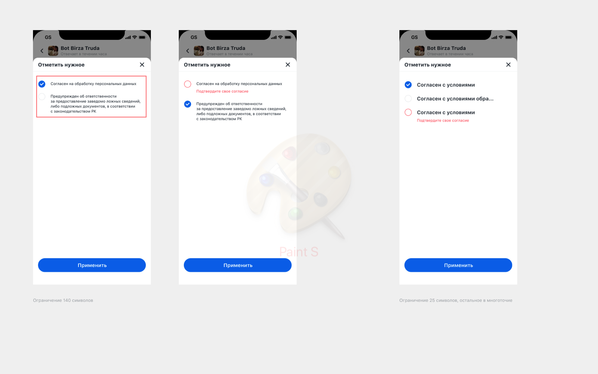

## Описание
Элемент на форме, который вызывает backdrop со списком значений для выбора

| Поле  | Необходимые  | Описание
|---|:---:|---|
| id | true | Уникальный идентификатор формы  |
| type  | true |  Тип элемента |
| title  | false |  Заголовок элемента |
| placeholder  | true |  Подсказка пользователю |
| Checkbox  | true |  Описание и настройки формы, которую необходимо открыть, по нажатию на компонент |
| Checkbox.options  | true |  Объект опций каталога |
| Checkbox.options.title  | true |  Заголовок используется для компонента Checkbox, что бы установить текст в шапке формы |
| options.search_enabled  | false |  Флаг для отображения компонента поиска по списку значений каталога, по умолчанию false |
| Checkbox.items  | true |  Массив элементов списка, ниже представлен минимальный набор данных необходимый для построения элемента списка |
| Checkbox.items[n].id  | true |  Уникальный идентификатор элемента |
| Checkbox.items[n].title  | true |  Заголовок элемента(Основной текст) |
| Checkbox.items[n].description  | false |  Описание элемента |
| file_metadata  | false |  Информация о файле |
| file_type  | true |  Тип файла |
| file_id  | true |   Уникальный идентификатор файла |
| file_name  | true |  Имя файла |
| validations_rules  | false |  Правила валидации поля |
| default_value  | false |  Предустановленное значение, любое из Checkbox.items[n] |

## Пример
```
{
  "id": "Checkbox_id",
  "type": "Checkbox",
  "title": "Title",
  "placeholder": "placeholder",
  "default_value": {},
  "validations_rules": [],
  "Checkbox": {
    "options": {
      "title": "title",
      "search_enabled": false
    },
    "items": [
      {
        "id": "",
        "title": "",
        "description": "",
        "file_metadata": {
          "file_type": "image",
          "file_id": "fileId",
          "filename": "fileName"
        }
      }
    ]
  }
}
```
