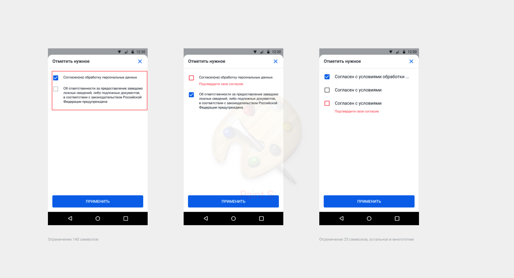

<strong>Дизайн на IOS</strong>


<strong>Дизайн на Android</strong>



## Описание
<p>Компонент для выбора пользователем указанного значения. Может использоваться самостоятельно с подписью, так и без подписи в составе наборов компонент.
</p>


|№ | Поле  | Необходимые  | Описание
|---|---|:---:|---|
|1| id | true | Уникальный идентификатор формы  |
|2| type  | true |  Тип элемента |
|3| title  | false |  Заголовок элемента |
|4| default_state  | true |  сheckbox с предвыборным состоянием, содержит в себе одно из значений (true/false). Если ботосоздатель не указал default_state, то нужно проставлять false |
|5| options  | true |  Настройки компонента |
|5.1| options.text_size  | false |  Размер вводимого текста, по умолчанию H3 |
|5.2| options.text_style | false |  Стиль вводимого текста, по умолчанию normal |
|5.3| options.text_style  | false |  Цвет вводимого текста, по умолчанию #000000 |
|6| validations_rules  | true |  Правила валидации |
|6.1| validations_rules[n].type  | true |  Флаг обязательности поля (<strong>только required</strong>) |
|6.2| validations_rules[n].value   | true |  Значение обязательности поля. Если пришел пустой объект, то умолчанию ставим false |
|6.3| validations_rules[n].error  | true |   Текст ошибки, которое выводится пользователю, если сработало правило валидации |

## Пример
```
{
  "id": "checkbox",
  "type": "checkbox",
  "title": "title",
  "default_state": true,
  "options": {
      "text_size": "H3",
      "text_color": "#000000",
      "text_style": "bold"
  }
  "validations_rules": [{
      "type": "required",
      "value": true,
      "error": "Необходимо выбрать одно значение"
  }]
}
```